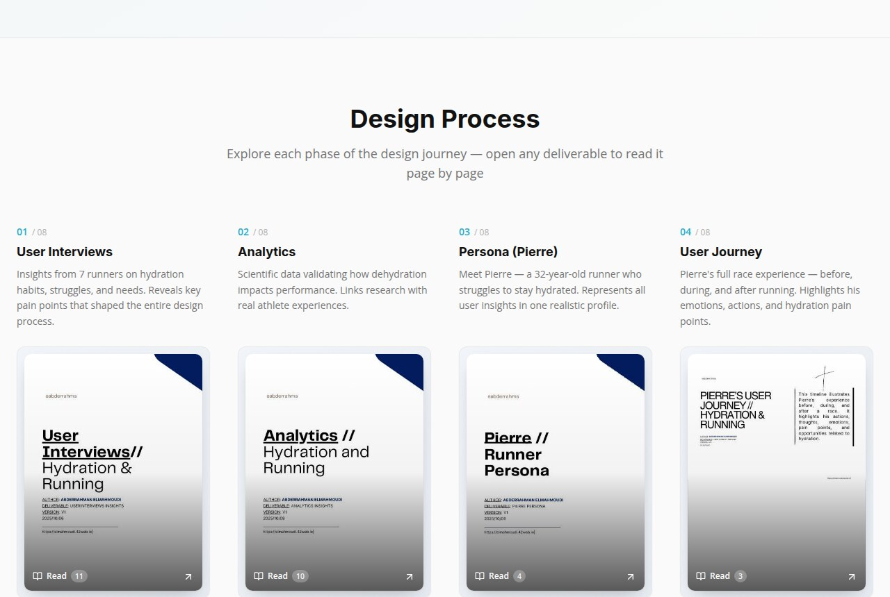
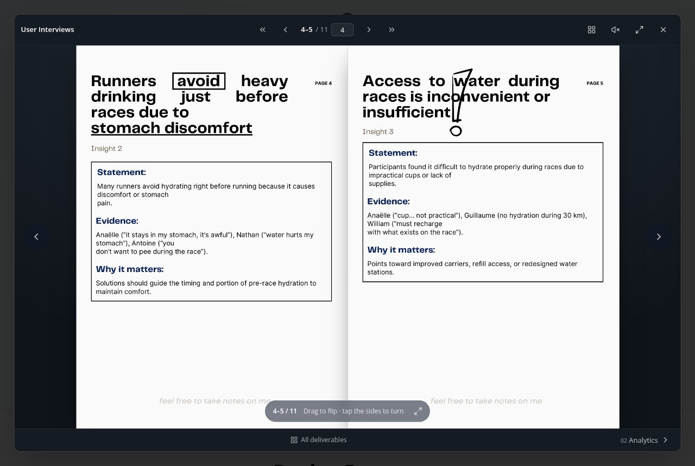
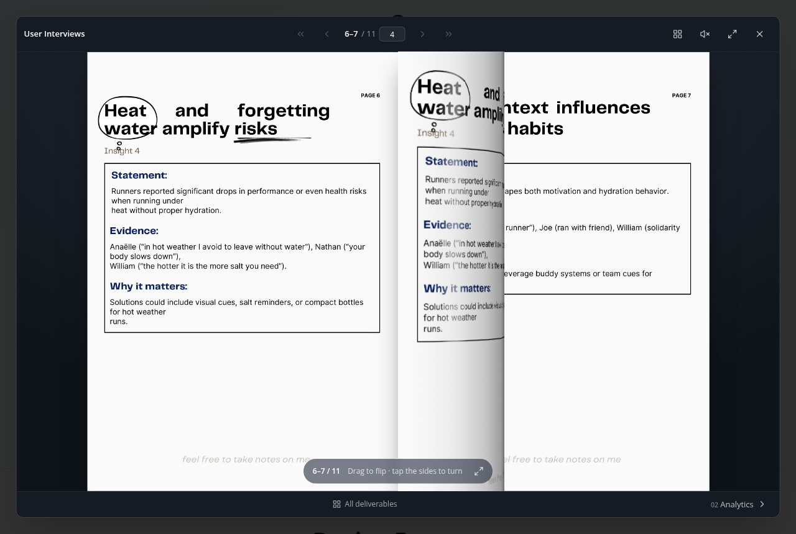

# Athlete Keep Hydrated

A UX project about a simple question: **why do runners who know hydration matters still get it wrong?**

The answer turned out to be timing, not knowledge. The project ends in a non-digital
solution — a wristband that changes colour with sweat and tells the runner when to drink.

**Zone01 UX Piscine · October 2025 · Abderrahman Elmahmoudi (Mars')**

Every phase of the work is published on the project site as a flipbook, so the full
deliverables can be read page by page.

## The problem

Runners already know they should hydrate. Most have read the advice, most carry a
bottle. What they cannot do is judge *when* to drink, so they guess: too much before a
race until it sits heavy, nothing during, and too much afterwards to catch up.

Three barriers keep repeating across the research — **timing** (no sense of when),
**access** (no water or no useful cups on the route) and **comfort** (drinking before a
race causes stomach discomfort). The published research backs the interviews up: losing
just 2% of body mass already costs endurance and concentration, and heat speeds up
fluid and salt loss.

## How I got there

| # | Phase | What came out of it |
|---|-------|---------------------|
| 01 | [User interviews](https://abdel-mars.github.io/Hydration-UX/?doc=user-interviews) | 7 runners, 8 insights on real habits and workarounds |
| 02 | [Analytics](https://abdel-mars.github.io/Hydration-UX/?doc=analytics) | 6 findings from published research, with sources |
| 03 | [Persona](https://abdel-mars.github.io/Hydration-UX/?doc=persona) | Pierre, 32, a runner who means to do the right thing |
| 04 | [User journey](https://abdel-mars.github.io/Hydration-UX/?doc=user-journey) | Before, during and after a race, with the pain points mapped |
| 05 | [Problem statement](https://abdel-mars.github.io/Hydration-UX/?doc=problem-statement) | One sentence and one question to guide the next phases |
| 06 | [Ideation](https://abdel-mars.github.io/Hydration-UX/?doc=ideation) | 20-minute constraint-led brainstorm, three voters, one winner |
| 07 | [Storyboard](https://abdel-mars.github.io/Hydration-UX/?doc=storyboard) | 6 hand-drawn scenes of the band in use |
| 08 | [Final product](https://abdel-mars.github.io/Hydration-UX/?doc=final-product) | The sweat-reactive Hydration Band, specified |

## The problem statement

> Pierre struggles to maintain a balanced hydration routine across his running
> experience. He often drinks too early or too late, avoids drinking during runs due to
> discomfort, and compensates with overhydration afterward.

That led to the question the rest of the project answers:

> How might we help Pierre prepare and maintain proper hydration before, during, and
> after a race using **simple, non-digital tools**?

## The solution

**The Hydration Band** — a stretch-fit wristband with sweat-responsive ink in its
fibres. As the runner works up and starts to sweat, the colour moves through the
phases of a session. Nothing to tap, no battery, no app, no screen. Once the band dries
it returns to grey and is ready for the next run.

| Colour | Meaning | What the runner does |
|--------|---------|----------------------|
| Grey | Ready | Check gear, hydrate calmly before the race |
| Blue | Body still cool | A small glass before the start |
| Yellow | Effort rising | Take one sip |
| Orange | High intensity | Hydrate steadily |
| Green | Cooling down | Rehydrate gradually |

Lightweight (20 g), washable for around 50 uses, and costed at under $10 a unit so it
could actually be produced at scale.

## What I learned

- **The constraint did the design work.** Forbidding apps and screens removed the
  obvious answers and pushed the idea towards a signal the body produces on its own.
- **The problem was never knowledge.** Runners knew what to do; they could not tell
  *when*. The solution had to answer "when", not "what".
- **Feedback tied to effort beats a reminder.** The colour changes because the runner
  is working hard, so it can be read mid-stride without demanding any attention.

## Read it online

**[athlete-keep-hydrated.page.gd](https://abdel-mars.github.io/Hydration-UX/)** — all eight
deliverables, each opening as a flipbook you can drag, swipe or step through.

- [Medium case study](https://medium.com/@elmahmoudimars/athlete-keep-hydrated-ux-piscine-project-at-zone01-1459077457c9)
- [Portfolio](http://elmahmoudi.42web.io)
- [Source documents and how they are re-rendered](src/pdfs/README.md)
